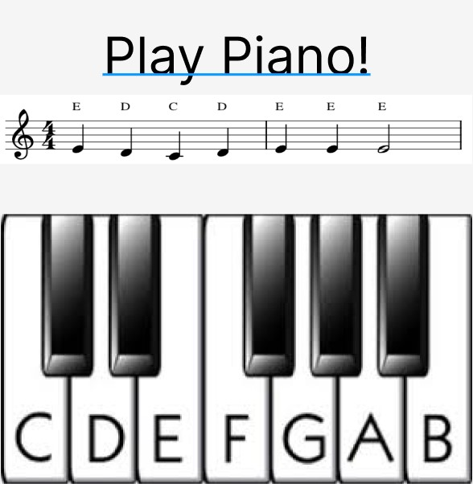
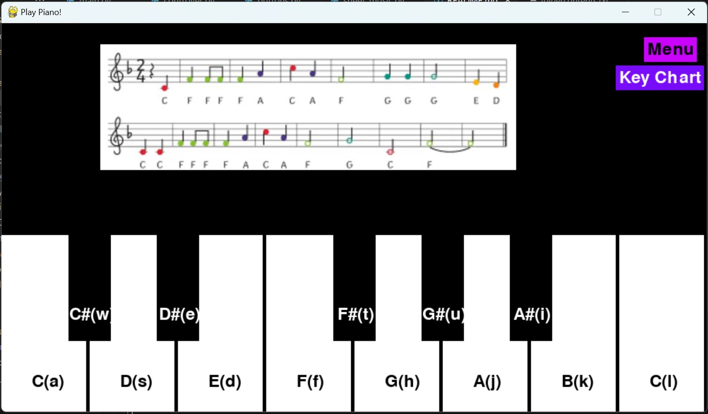

# Play Piano
## CS110 Final Project Fall, 2024 

## Team Members

Clare Calandra 

***

## Project Description

My project will simulate playing a piano with thirteen keys represented by certain letters on a computer keyboard. This program facilitates learning the instrument by allowing the user to practice various simple songs. 

***    

## GUI Design

### Initial Design

 

### Final Design

 

## Program Design

### Features

1. Song menu has various buttons labeled with song names to choose from 
2. Labeled and interactive piano keys 
3. Sound plays when respective keys are pressed 
4. Sheet music is displayed based on the song chosen 
5. Keys pressed change color 

### Classes

- Controller: Creates and manages the program resources(models, framework, events) 
- Buttons: Creates an object that is rectangular shaped with the ability to have text on it. Includes a method that loads a music file to play a note when the method is called. 
- Sheet_music: Creates an object that is rectangular with an image loaded from the folder "assets" displayed on it. 

## ATP 
1. Confirm that the welcome button "Play" leads to the menu screen 
| Step |          Procedure         |                               Expected Results                              | 
|------|:--------------------------:|----------------------------------------------------------------------------:| 
|  1   |Start the game              |GUI window appears with purple welcome screen that says "Welcome to Play     | 
|      |                            |Piano!" and has two buttons "Play" and "Keychart"                            | 
|  2   |Click the "Play" button     |Displays the menu screen with 9 buttons labeled with song names              | 

2. Verify the correct image of the song appears when the corresponding button is clicked. 
| Step |          Procedure         |                               Expected Results                              | 
|------|:--------------------------:|----------------------------------------------------------------------------:| 
|  1   |Start the game              |GUI window appears with purple welcome screen that says "Welcome to Play     |
|      |                            |Piano!" and has two buttons "Play" and "Keychart"                            | 
|  2   |Click the "Play" button     |Displays the menu screen with 9 buttons labeled with song names              | 
|  3   |Click on the button that    |Displays a piano keyboard with 13 keys(including sharps) that are all labeled|
|      |says "C Major scale"        |and an image with a scale with notes labeled "C D E F G A B C"               | 

3. Tests that the corresponding note plays when a key is pressed. 
| Step |          Procedure         |                               Expected Results                              | 
|------|:--------------------------:|----------------------------------------------------------------------------:| 
|  1   |Start the game              |GUI window appears with purple welcome screen that says "Welcome to Play     |
|      |                            |Piano!" and has two buttons "Play" and "Keychart"                            | 
|  2   |Click the "Play" button     |Displays the menu screen with 9 buttons labeled with song names              | 
|  3   |Click on the button that    |Displays a piano keyboard with 13 keys(including sharps) that are all labeled|
|      |says "C Major scale"        |and an image with a scale with notes labeled "C D E F G A B C"               | 
|  4   |Press a on your keyboard    |A C note should sound from your computer.                                    | 

4. Confirms the keychart displays when the keychart button is clicked 
| Step |          Procedure         |                               Expected Results                              | 
|------|:--------------------------:|----------------------------------------------------------------------------:| 
|  1   |Start the game              |GUI window appears with purple welcome screen that says "Welcome to Play     |
|      |                            |Piano!" and has two buttons "Play" and "Keychart"                            | 
|  2   |Click the "Key Chart" button|Displays a black screen with a chart of a keyboard labeled with notes        | 

5. Verify that the keys only play when the keyboard is shown
| Step |          Procedure         |                               Expected Results                              | 
|------|:--------------------------:|----------------------------------------------------------------------------:| 
|  1   |Start the game              |GUI window appears with purple welcome screen that says "Welcome to Play     |
|      |                            |Piano!" and has two buttons "Play" and "Keychart"                            | 
|  2   |Press the key a             |No noise should come from the computer                                       | 
|  3   |Click the "Play" button     |No noise should come from the computer                                       | 
|  4   |Click on the button that    |A screen with a piano keyboard and an image with the sheet music for Happy   | 
|      |says "Happy Birthday"       |Birthday should be displayed with a menu and keychart button in the corner   | 
|  5   |Press s on your keyboar     |The note D should sound                                                      | 
|  6   |Click "menu"                |Menu screen with all songs should display                                    | 
|  7   |Press s on your keyboard    |No noise should come from the computer                                       | 